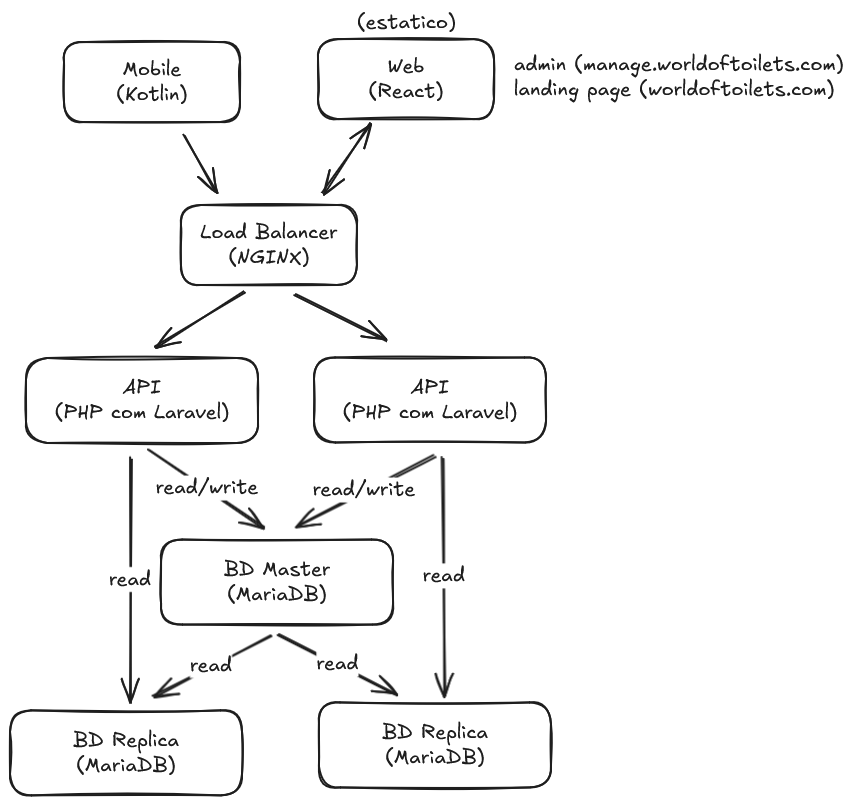

# World of Toilets

**Universidade:** [Universidade Europeia](https://www.europeia.pt/)  
**Faculdade:** [IADE - Faculdade de Design, Tecnologia e Comunicação](https://www.iade.europeia.pt/)  
**Repositório:** [worldoftoilets](https://github.com/nycocado/worldoftoilets)  
**Curso:** Engenharia Informática

## Índice

- [World of Toilets](#world-of-toilets)
  - [Índice](#índice)
  - [Elementos da Equipa](#elementos-da-equipa)
  - [Palavras-Chave](#palavras-chave)
  - [Descrição](#descrição)
    - [Motivação](#motivação)
    - [Objetivos](#objetivos)
  - [Público-Alvo](#público-alvo)
  - [Pesquisa de Mercado](#pesquisa-de-mercado)
    - [Where is the Toilet](#where-is-the-toilet)
    - [Berlin Toilet](#berlin-toilet)
    - [Flush](#flush)
    - [Where is Public Toilet](#where-is-public-toilet)
  - [Personas](#personas)
    - [Matilde Homão](#matilde-homão)
    - [David Barção](#david-barção)
    - [Maria Cunha](#maria-cunha)
  - [Casos de Utilização](#casos-de-utilização)
    - [Localizar a melhor casa de banho próxima](#localizar-a-melhor-casa-de-banho-próxima)
    - [Feedback da casa de banho](#feedback-da-casa-de-banho)
    - [Pesquisar casa de banho específica](#pesquisar-casa-de-banho-específica)
  - [Descrição da Solução](#descrição-da-solução)
  - [Enquadramento das Unidades Curriculares](#enquadramento-das-unidades-curriculares)
    - [Engenharia de Software](#engenharia-de-software)
    - [Inteligência Artificial](#inteligência-artificial)
    - [Segurança Informática](#segurança-informática)
    - [Sistemas Distribuídos](#sistemas-distribuídos)
  - [Requisitos Técnicos](#requisitos-técnicos)
    - [Requisitos Funcionais Antigos (Think Toilet)](#requisitos-funcionais-antigos-think-toilet)
    - [Requisitos Funcionais Novos (World of Toilets)](#requisitos-funcionais-novos-world-of-toilets)
    - [Requisitos Não Funcionais Antigos (Think Toilet)](#requisitos-não-funcionais-antigos-think-toilet)
    - [Requisitos Não Funcionais Novos (World of Toilets)](#requisitos-não-funcionais-novos-world-of-toilets)
  - [Arquitetura da Solução](#arquitetura-da-solução)
    - [Componentes da Arquitetura](#componentes-da-arquitetura)
      - [Infraestrutura](#infraestrutura)
      - [Front-end (Web)](#front-end-web)
      - [Front-end (Aplicação Móvel)](#front-end-aplicação-móvel)
      - [Back-end (Servidor)](#back-end-servidor)
      - [Base de Dados](#base-de-dados)
  - [Tecnologias](#tecnologias)
    - [Infraestrutura](#infraestrutura-1)
    - [Desenvolvimento Móvel](#desenvolvimento-móvel)
    - [Desenvolvimento Back-End](#desenvolvimento-back-end)
    - [Bases de Dados](#bases-de-dados)
    - [Prototipação](#prototipação)
  - [Conclusão](#conclusão)

## Elementos da Equipa

- [Nycolas Souza](https://github.com/nycocado) - 20230989
- [Luan Ribeiro](https://github.com/Ninjaok) - 20230692
- [Lohanne Guedes](https://github.com/Lohannecristina) - 20220085
- [Margarida Sousa](https://github.com/Kira-Sousa) - 20231205

## Palavras-Chave

Localizador; Avaliação; Sanitários; Casa de banho; Público; Privada; Busca; Próximas; Aplicação; Mobile; Web; Guia; Navegação; Google Maps; Encontrar; Rotas; Busca; Mapa; Interativo; App; Recomendação; Inteligência Artificial; Sugestão; Crowdsourcing;

## Descrição

O **[World of Toilets](https://github.com/nycocado/worldoftoilets)** é uma aplicação móvel projetada para resolver um problema comum: localizar casas de banho limpas e acessíveis. Muitas vezes, as pessoas enfrentam dificuldades para encontrar uma casa de banho, especialmente em situações de emergência ou em áreas desconhecidas.

### Motivação

O **[World of Toilets](https://github.com/nycocado/worldoftoilets)** é uma versão aprimorada de um projeto criado em setembro de 2024, chamado **[Think Toilet](https://github.com/nycocado/think-toilet)**. Essa nova versão expande a proposta inicial, trazendo melhorias focadas no backend, otimizando a infraestrutura, reduzindo custos operacionais e melhorando a relação com a comunidade, além de tornar o sistema mais estável e escalável. A sua conceção foi inspirada por movimentos e tendências que destacaram a importância da higiene e do acesso a casas de banho públicas de qualidade nos últimos anos.

Um desses movimentos foi o **["Spreadshit"](https://exame.com/pop/spreadshit-planilha-avalia-banheiros-empresas)**, um evento viral em 2022 que popularizou reviews humorísticas de casas de banho. A pandemia de COVID-19, que levou ao fechamento de muitas casas de banho públicas, fez com que encontrar uma casa de banho acessível se tornasse um desafio.

Com o fechamento de estabelecimentos e preocupações sobre a limpeza das casas de banho disponíveis, as pessoas começaram a compartilhar suas experiências online, formando uma comunidade disposta a ajudar na busca por opções mais seguras e limpas.

Além disso, muitos sistemas de busca de casas de banho não são atualizados, complicando a vida dos usuários. Com isso, percebemos a necessidade de uma solução prática e eficaz. Portanto, queremos desenvolver uma aplicação que ajude as pessoas a encontrar casas de banho limpas e acessíveis, permitindo também a avaliação e sugestão de novos locais, criando uma base de dados mais confiável e útil.

### Objetivos

- Facilitar a busca de casas de banho limpas e próximas.
- Permitir um ambiente saudável para o desenvolvimento da comunidade.
- Avaliação e feedback contínuos.
- Integração com mapas e navegação.

## Público-Alvo

O público-alvo da aplicação **[World of Toilets](https://github.com/nycocado/worldoftoilets)** inclui:

- Trabalhadores em trânsito, como motoristas, entregadores e motoristas de camião, que frequentemente necessitam de acesso a casas de banho durante o trabalho.
- Turistas e viajantes que estão explorando novas áreas e precisam localizar sanitários próximos.
- Pessoas com necessidades de acessibilidade, que buscam informações sobre instalações adaptadas.
- Profissionais que trabalham em campo, como trabalhadores da construção civil e eletricistas, que podem não ter acesso a instalações adequadas durante o dia de trabalho.

## Pesquisa de Mercado

A nossa pesquisa sobre aplicações para busca de casas de banho foi um dos principais motivos para a escolha do tema do projeto. A maioria deles apresenta uma interface deficiente e poucas funções úteis além da localização dos sanitários.

### [Where is the Toilet](https://play.google.com/store/apps/details?id=com.iisrl.toilet.star.toilet_star&hl=pt_PT)

A aplicação funciona como um localizador de casas de banho, permitindo avaliações e a criação de novas.

- **Pontos Positivos:** Interface limpa, sem informações desnecessárias, facilitando a navegação.
- **Pontos Negativos:** Poucas casas de banho disponíveis. Apesar de parecer italiana, não encontramos opções na Itália. O sistema de busca é pouco intuitivo e o mapa não atualiza automaticamente, sendo necessário clicar para mostrar as casas de banho próximas.
- **Melhorias Feitas:** Automatização do mapa, mostrando as casas de banho próximas sem a necessidade de clicar.

### [Berlin Toilet](https://play.google.com/store/apps/details?id=com.futurice.berlintoiletapp&hl=pt_PT)

É uma aplicação para localização de casas de banho, utilizando o Google Maps para indicar direções e permitindo avaliações categóricas.

- **Pontos Positivos:** Sistema de localização intuitivo, permite saber se o estabelecimento é pago e oferece acessibilidade.
- **Pontos Negativos:** Interface fraca, não permite comentários sobre as casas de banho e as notas dos utilizadores não aparecem de forma imediata.
- **Melhorias Feitas:** Exibir a média de notas dos utilizadores na ecrã inicial para facilitar a escolha, permitir comentários e melhorar a interface.

### [Flush](https://play.google.com/store/apps/details?id=toilet.samruston.com.toilet&hl=pt_PT)

Aplicação de localização de casas de banho.

- **Pontos Positivos:** Localiza rapidamente casas de banho no mapa, indicando se são pagos, acessíveis ou trancados. Permite criar casas de banho e reportar problemas.
- **Pontos Negativos:** Falta filtragem nas criações, avaliações e comentários não aparecem, não mostra as casas de banho mais próximas e não permite traçar rotas.
- **Melhorias Feitas:** Exibir avaliações e comentários, mostrar as mais próximas e permitir rotas.

### [Where is Public Toilet](https://play.google.com/store/apps/details?id=sfcapital.publictoiletinsouthaustralia&hl=pt_PT)

Aplicação para localizar casas de banho públicas, com informações úteis como avaliações e acessibilidade.

- **Pontos Positivos:** Lista de casas de banho por distância, com avaliações, horários de funcionamento, favoritos e compartilhamento. Mostra pins no mapa e oferece rota.
- **Pontos Negativos:** Necessita baixar a base de dados a cada instalação, o que é demorado. Não possui comentários e a interface é confusa e pouco intuitiva.
- **Melhorias Feitas:** Simplificar a interface, permitir comentários e avaliações, e facilitar a navegação.

## Personas

### Matilde Homão

- **Idade:** 21 anos
- **Sexo:** Feminino
- **Ocupação:** Motorista de aplicação e Estudante
- **Descrição:** Matilde é uma jovem motorista de aplicação que enfrenta diversos desafios no seu dia a dia, como deslocar-se por diferentes locais e gerir a rotina entre o trabalho e os estudos numa universidade de prestígio.
- **Objetivo:** Devido à natureza dinâmica do seu trabalho como motorista de aplicação, Matilde precisa localizar de forma rápida e eficiente casas de banho de qualidade em diferentes regiões.
- **Frustrações:** Dificuldade em encontrar casas de banho em locais desconhecidos ou remotos.

### David Barção

- **Idade:** 20 anos
- **Sexo:** Masculino
- **Ocupação:** Turista e Empreendedor
- **Descrição:** David é um jovem empreendedor em busca de autoconhecimento, decidido a explorar o mundo após desenvolver uma carreira de sucesso. Viajar é a sua forma de se conectar consigo mesmo e com diferentes culturas.
- **Objetivo:** David procura as rotas mais eficientes para explorar novos países e, durante as suas viagens, precisa localizar casas de banho confortáveis e acessíveis em diferentes regiões.
- **Frustrações:** Devido às suas constantes viagens, David frequentemente desconhece as características e comodidades das regiões onde irá pernoitar. Por isso, sente a necessidade de uma aplicação que facilite a localização de casas de banho confortáveis e próximas.

### Maria Cunha

- **Idade:** 39 anos
- **Sexo:** Feminino
- **Ocupação:** Jornalista, Dentista e Gestante
- **Descrição:** Maria cuida de um bebé de 8 meses e enfrenta os desafios de uma rotina intensa. Para lidar com as necessidades do seu filho, precisa estar sempre preparada para trocar fraldas e oferecer cuidados adequados, mesmo em locais fora de casa.
- **Objetivo:** Localizar rapidamente casas de banho equipadas com fraldários que atendam a altos padrões de limpeza e conforto.
- **Frustrações:** Devido à sua rotina corrida, Maria encontra dificuldades em encontrar casas de banho adequadas e bem equipadas para cuidar do seu bebé, o que adiciona estresse à sua jornada diária.

## Casos de Utilização

### Localizar a melhor casa de banho próxima

**Persona: Matilde Homão**  
Consideramos a localização da melhor casa de banho próxima como o objetivo principal do projeto, seguindo estes passos:

- Matilde encontra-se num local desconhecido e precisa urgentemente de uma casa de banho.
- A Matilde acede à aplicação e visualiza o mapa.
- No mapa, são exibidas as casas de banho mais próximas, já na parte inferior, aparece a primeira casa de banho, e Matilde pode deslizar para ver as cinco opções mais próximas.
- Independentemente do método escolhido para aceder à casa de banho, o Matilde será redirecionado para a janela da casa de banho escolhida.
- Nessa janela, o Matilde pode clicar no botão escrito "Abrir no Maps", que o levará ao Google Maps, onde poderá escolher a rota até à casa de banho.

### Feedback da casa de banho

**Persona: Maria Cunha**  
O segundo caso envolve a avaliação de uma casa de banho:

- Maria utilizou uma casa de banho e gostaria de avaliar a excelente experiência que teve, compartilhando seu feedback positivo sobre a limpeza, conforto e acessibilidade do local.
- O Maria acede à aplicação e visualiza o mapa.
- No mapa, são exibidas as casas de banho mais próximas, já na parte inferior, destaca-se a primeira casa de banho que Maria utilizou, seguindo a recomendação da aplicação.
- Após selecionar a primeira casa de banho, o Maria é redirecionado para a janela da casa de banho selecionada.
- Nessa janela, o Maria clica no botão "Avaliar" e é levado à ecrã de avaliações.
- Maria pode comentar sobre a sua experiência e avaliar categorias como "Limpeza", "Papel", "Estrutura" e "Acessibilidade".
- Para concluir, o Maria clica no botão de confirmação para publicar a sua avaliação.

### Pesquisar casa de banho específica

**Persona: David Barção**  
Este caso trata da busca por uma casa de banho específica pelo utilizador:

- David viajou para Lisboa, um destino que nunca havia visitado antes. Agora, hospedado em seu hotel, ele deseja planejar sua viagem como turista, explorando a capital de Portugal e seus principais pontos turísticos
- David acede à aplicação e visualiza o mapa.
- Na parte superior, clica no botão de pesquisa.
- O teclado é acionado, e o utilizador pode digitar a localização ou o nome do estabelecimento onde a casa de banho se encontra.
- Após a pesquisa, a aplicação exibe a casa de banho desejada, e David pode clicar para visualizar mais detalhes e avaliações.
- David pode então escolher a melhor rota para chegar à casa de banho, clicando no botão "Abrir no Maps".

## Descrição da Solução

O projeto **[World of Toilets](https://github.com/nycocado/worldoftoilets)** é uma aplicação móvel que ajuda os utilizadores a encontrar e avaliar casas de banho próximas. A aplicação exibe um mapa interativo com as casas de banho mais bem avaliadas e fornece informações como preço, acessibilidade e restrições de uso (gratuito, público ou para clientes). Os utilizadores podem avaliar critérios como limpeza, acessibilidade, papel disponível e estrutura, além de deixar comentários. A aplicação também permite sugerir novas casas de banho, denunciar locais ou comentários inadequados e visualizar seu histórico de avaliações. Com integração ao Google Maps, oferece rotas para facilitar o acesso aos locais.

## Enquadramento das Unidades Curriculares

### Engenharia de Software

Iremos aplicar os princípios de Engenharia de Software para estruturar o projeto, desde a definição de requisitos funcionais e não funcionais até à entrega. Planeamos modelar o sistema com UML (casos de uso, classes e sequência), adotar um processo ágil (Scrum/Kanban) com sprints, backlog e reviews, e usar conceitos avançados de documentação para garantir rastreabilidade, clareza e manutenção eficiente do projeto. Usaremos Git com branching e code reviews, e manteremos testes (unidade, integração e cobertura) como critério de qualidade. Quando fizer sentido, integraremos CI para execução automática dos testes.

### Inteligência Artificial

A componente de Inteligência Artificial é necessária para determinar rotas otimizadas entre diferentes casas de banho, com base na localização do utilizador e nas características do mapa. Este problema enquadra-se na procura informada em grafos, sendo adequado o uso do algoritmo A*, que utiliza uma função heurística para estimar o custo até ao destino e assim encontrar o caminho mais eficiente.

A escolha do A* justifica-se por se tratar de um problema de procura de caminhos em ambientes conhecidos, onde o objetivo é otimizar trajetos de forma determinística e eficiente. Outras abordagens, como problemas de satisfação de restrições (CSP) ou aprendizagem por reforço, não seriam adequadas, dado que o espaço de estados e os custos são bem definidos e não exigem adaptação dinâmica.

### Segurança Informática

Implementaremos autenticação de utilizadores com gestão segura de credenciais (hashing com salt) e autorização por perfis, bem como gestão de sessões baseada em chaves. As chaves de sessão serão geradas de forma aleatória, com expiração e renovação, e armazenadas de modo seguro (por exemplo, cookies com HttpOnly, Secure e SameSite, quando aplicável). Forçaremos HTTPS em todos os endpoints, com redirecionamento de HTTP para HTTPS. Aplicaremos encriptação de dados sensíveis em repouso, validação de entradas e tratamento de erros sem exposição de detalhes técnicos. Registaremos eventos relevantes (logins, alterações de permissões, erros críticos) e manteremos documentação breve dos procedimentos, acrescentando controlos complementares conforme a evolução do projeto.

### Sistemas Distribuídos

Projetaremos o sistema com réplicas do serviço para evitar ponto único de falha e facilitar escala. O tráfego será distribuído por um load balancer (balanceamento de carga) com health checks simples para retirar instâncias com problemas. Teremos replicação de dados para melhorar a fiabilidade e a disponibilidade.

## Requisitos Técnicos

### Requisitos Funcionais Antigos (Think Toilet)

- Os usuários devem poder buscar casas de banho próximas por localização no mapa.
- Os usuários devem poder visualizar detalhes das casas de banho e avaliações, com a média das avaliações categóricas e a média geral das avaliações.
- Os usuários devem poder avaliar casas de banho, deixando comentários e notas sobre limpeza, acessibilidade, disponibilidade de papel e estrutura.
- Os usuários devem poder ver seu histórico de avaliações.
- Os usuários obrigatoriamente devem ser registados e ter uma conta na plataforma para poder interagir com a comunidade.
- A aplicação deve permitir que os usuários denunciem locais ou comentários inadequados.

### Requisitos Funcionais Novos (World of Toilets)

- Os usuários devem poder filtrar a busca de casas de banho por necessidades específicas.
- Os usuários devem poder sugerir novas casas de banho.
- Os usuários devem poder comentar apenas nos comentários principais das casas de banho, sem permitir respostas em cadeia.
- As empresas devem poder participar da comunidade e receber um selo de verificação, caso provem sua autenticidade.
- A aplicação deve permitir que os usuários denunciem outros usuários inadequados.
- A aplicação deve ser capaz de traçar rotas até os locais, tendo Portugal como seu escopo principal.

### Requisitos Não Funcionais Antigos (Think Toilet)

- A interface deve ser intuitiva e responsiva, proporcionando uma experiência de usuário agradável.
- O sistema deve permitir a moderação eficiente de comentários e sugestões, incluindo a análise de conteúdo para determinar se ele deve ser mantido, editado ou removido.
- A aplicação móvel deve ser compatível com [Android 9 (API Level 28)](https://developer.android.com/tools/releases/platforms#9.0) ou superior.
- Deve ser utilizado [Kotlin](https://kotlinlang.org) com [Jetpack Compose](https://developer.android.com/compose) para a interface do usuário na aplicação móvel.
- Todos os dados sensíveis dos usuários devem ser encriptados antes de serem armazenados.
- Integração com o [OpenStreetMap API](https://www.openstreetmap.org) para fornecer direções e exibir casas de banho no mapa.

### Requisitos Não Funcionais Novos (World of Toilets)

- O sistema deve ser escalável horizontalmente, para alta disponibilidade e evitar ponto único de falha.
- Devem haver administradores de diferentes níveis de responsabilidade, para aprovar sugestões de casas de banho e revisar denúncias.
- Os administradores devem ter acesso a um dashboard para gerir a comunidade.
- Tanto o dashboard, quanto a landing page, devem ser construídas utilizando [TypeScript](https://www.typescriptlang.org/) com [React](https://react.dev/) de forma estática.
- Os usuários devem utilizar JWT tokens para gerir as sessões dos usuários de forma serverless.
- Deve ser utilizado [PHP](https://www.php.net/) com [Laravel](https://www.laravel.com) para manipulação de dados.
- Utilização de [MariaDB](https://mariadb.org/) para o armazenamento de dados, incluindo informações sobre usuários, casas de banho, avaliações e sugestões.

## Arquitetura da Solução

A arquitetura da solução do projeto **[World of Toilets](https://github.com/nycocado/worldoftoilets)** é projetada para ser modular e escalável, abrangendo cinco componentes principais: a infraestrutura, o front-end (web), o front-end (aplicação móvel), o back-end (servidor) e a base de dados.

### Componentes da Arquitetura

#### Infraestrutura

A infraestrutura do projeto utilizará **[NGINX](https://nginx.org/)** como servidor web e balanceador de carga (load balancer), garantindo alta disponibilidade e distribuição eficiente do tráfego entre os serviços. A gestão e orquestração dos ambientes será feita com **[Docker](https://www.docker.com/)**, permitindo o isolamento, escalabilidade e padronização dos containers de aplicação, base de dados e demais serviços.

#### Front-end (Web)

Desenvolvido em [TypeScript](https://www.typescriptlang.org/) com [React](https://react.dev/), o site em web terá uma landing page para apresentar o projeto, além de um dashboard para administradores, onde será feita a moderação da comunidade, com acesso também a informações estatísticas.

#### Front-end (Aplicação Móvel)

Desenvolvida em **[Kotlin](https://kotlinlang.org)** com **[Jetpack Compose](https://developer.android.com/compose)** para a interface de usuário, a aplicação permitirá aos usuários buscar casas de banho, visualizar detalhes, fazer avaliações e sugerir novos locais. A integração com o **[OpenStreetMap API](https://www.openstreetmap.org)** fornecerá um mapa interativo com direções.

#### Back-end (Servidor)

Construído com **[PHP](https://www.php.net/)** e **[Laravel](https://www.laravel.com)**, o servidor implementará uma arquitetura RESTful para facilitar a comunicação entre o front-end e o back-end. Ele gerenciará dados sobre casas de banho, avaliações e usuários, garantindo a integridade das informações.

#### Base de Dados

Utilizando **[MariaDB](https://mariadb.org/)**, a base de dados será projetada para armazenar informações sobre usuários, casas de banho, avaliações e sugestões. A estrutura relacional garantirá eficiência nas consultas e integridade dos dados.

## Tecnologias

### Infraestrutura

- **Load Balancer e Servidor Web:** [NGINX](https://nginx.org/)
- **Containers:** [Docker](https://www.docker.com/)

### Desenvolvimento Móvel

- **Linguagem:** [Kotlin](https://kotlinlang.org)
- **Framework:** [Jetpack Compose](https://developer.android.com/compose)
- **SDK:** [Android SDK 28](https://developer.android.com/tools/releases/platforms#9.0)
- **Integração:** [OpenStreetMap API](https://www.openstreetmap.org)

### Desenvolvimento Back-End

- **Linguagem:** [PHP](https://www.php.net/)
- **Framework:** [Laravel](https://www.laravel.com)

### Bases de Dados

- **Sistema SQL:** [MariaDB](https://mariadb.org/)

### Prototipação

- **Software:** [Figma](https://www.figma.com/) para design e prototipação da interface do usuário.

## Conclusão

O **[World of Toilets](https://github.com/nycocado/worldoftoilets)** busca fornecer uma solução eficaz para facilitar a localização de casas de banho públicas e privadas, ao mesmo tempo que melhora a experiência do utilizador através de um sistema de avaliações detalhadas. A aplicação permite que os utilizadores encontrem rapidamente casas de banho próximas, com base em critérios como limpeza, acessibilidade e preço. Além disso, o projeto promove a colaboração dos utilizadores através de sugestões de novos locais e avaliações, criando assim uma base de dados sempre atualizada e confiável.

Outro ponto central é incentivar a participação ativa dos utilizadores na avaliação de casas de banho, permitindo que encontrem as melhores opções e forneçam feedback valioso. Este retorno beneficia não apenas os utilizadores, mas também as empresas responsáveis pelas casas de banho, oferecendo informações detalhadas sobre a experiência do público e ajudando-as a identificar áreas de melhoria e aprimorar os seus serviços. A aplicação inclui ainda um mapa próprio, com rotas calculadas por IA, facilitando o acesso e a navegação pelos locais recomendados.

Ao final, **[World of Toilets](https://github.com/nycocado/worldoftoilets)** busca não apenas atender a uma necessidade prática, mas também criar uma comunidade de utilizadores colaborativa e engajada, proporcionando uma solução abrangente e útil para o cotidiano de todos, com impacto positivo tanto para os utilizadores como para as empresas.
